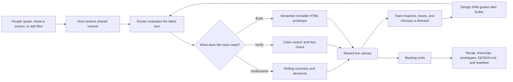
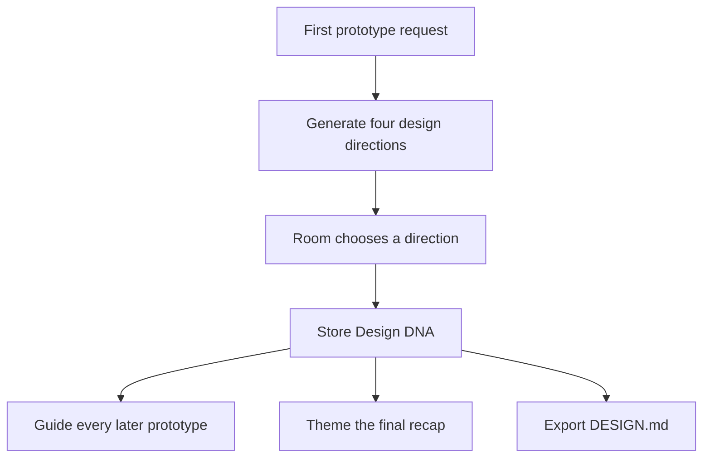
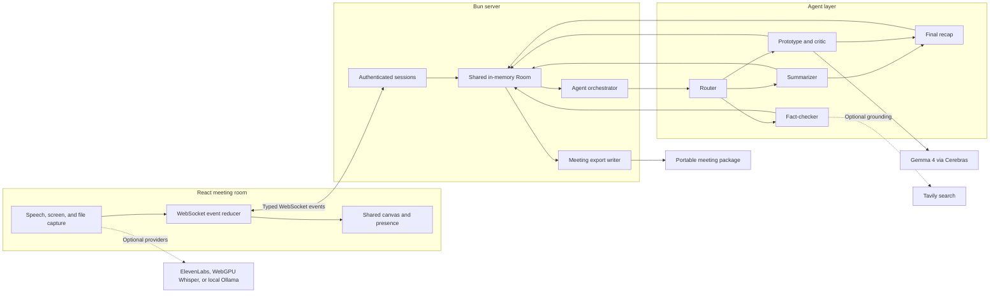
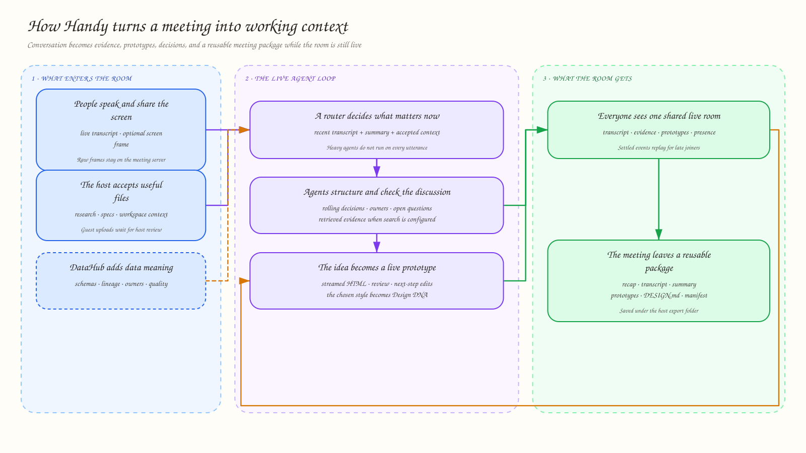

<div align="center">

# Handy

**A shared AI workspace that turns live conversation, screen context, and reviewed files into runnable prototypes, checked claims, decisions, and a reusable meeting package while the discussion is still happening.**

Hackathon MVP · Bun + React · Cerebras + Gemma 4

</div>

> Handy runs end to end in keyless fixture mode. Live inference, web-grounded fact-checking, and provider-based transcription require their respective credentials.

<!-- README-HACK:NEEDS-OWNER key="demo-video" instruction="Replace with the final public demo video URL near the top of the README." -->

## The idea

Most meeting tools tell a team what happened after the call. That is useful for recall, but it does not close the gap between discussing an idea and having something concrete enough to evaluate.

Handy works inside that gap. As people speak, a lightweight router decides whether the room needs an updated summary, a fact-check, or a prototype. The selected agent streams its result into one shared canvas, giving everyone something they can inspect, challenge, and refine before the conversation moves on.

The central bet is **temporal coupling**: a working artifact is qualitatively more useful when it appears while the idea is still alive in the room.

### The idea-to-artifact cliff

The project includes an A/B benchmark that sends the same prototype prompt to the same Gemma 4 model family through Cerebras and a local Ollama GPU baseline.

| Engine | Measured throughput | Idea to visible artifact |
| --- | ---: | ---: |
| Cerebras `gemma-4-31b` | ~1,588 tok/s | **~1.5 s** |
| Local Ollama `gemma4:31b` | ~50 tok/s | ~46 s |

These are project benchmark results, not general provider guarantees; local hardware and generation length affect the outcome. Their product implication is the point: at roughly 1.5 seconds, the room can react now. At roughly 46 seconds, the discussion has usually moved on.

## How a meeting moves through Handy



## What works today

| Capability | What participants experience |
| --- | --- |
| **Live prototype generation** | A spoken idea becomes a self-contained HTML artifact streamed into a sandboxed canvas. A recent screen frame can be included when the speaker refers to what is being shown. |
| **Shared room** | A host invites guests; everyone receives the same typed WebSocket event stream with presence, cursors, transcript, artifacts, fact-checks, and meeting state. |
| **Routed agent panel** | A router selectively invokes summarization, fact-checking, prototype generation, critique, next-step suggestions, and the final recap instead of running every agent on every utterance. |
| **Design DNA** | The first build fans out multiple visual directions. The chosen style guides later prototypes and is exported as a portable `DESIGN.md`. |
| **Reviewed context** | Participants can add files; guest uploads remain pending until the host accepts or rejects them. Accepted text context is available to the meeting agents. |
| **Flexible transcription** | The browser supports ElevenLabs Scribe v2 Realtime, on-device WebGPU Whisper, local Gemma through Ollama, and the Web Speech API. |
| **Honest fact-checking** | With Tavily configured, claims are searched and judged against retrieved snippets. Without search configuration, Handy labels the result as model-based rather than web-grounded. |
| **Durable handoff** | Ending a meeting writes a recap, transcript, structured summary, prototypes, `DESIGN.md`, a README, and a manifest to the host export folder. |

## The learning loop

The first prototype is not only an output; it is a preference probe. Handy generates four visual directions, lets the room pick one, and turns that choice into session-level Design DNA. Later artifacts use the selected language without repeating the fan-out.

That same style is carried into the final recap and serialized to Google's `DESIGN.md` format, so the meeting leaves with both the work and the design intent behind it.



## System architecture



The frontend and server compile against the same `@handy/shared` Zod schemas and discriminated event unions. The server keeps each WebSocket session thin; one shared `Room` owns presence, invites, accepted context, learned taste, meeting history, and the orchestrator. The MVP deliberately uses no database.

### Detailed context map



The dashed DataHub metadata node in this existing project diagram is **planned**, not part of the current implementation.

## Built with

- **Bun workspaces** for the TypeScript monorepo and server runtime
- **React 18, Vite 5, Tailwind CSS 4, Radix UI, and shadcn** for the browser experience
- **Bun WebSockets** for the shared event stream
- **Zod** for the shared protocol and structured agent outputs
- **`universal-llm-client`** for Gemma 4 inference through Cerebras
- **Tavily** for optional web-grounded fact-checking
- **ElevenLabs, Transformers.js/WebGPU Whisper, Web Speech, and Ollama** as transcription paths
- **Docker Compose and Tailscale Serve** for private, single-node sharing

## Run locally

### Keyless demo mode

Requires [Bun](https://bun.sh) 1.1 or newer.

```bash
bun install
cp .env.example .env
bun run dev
```

Open [http://localhost:5173/dashboard](http://localhost:5173/dashboard). The checked-in `.env.example` defaults to mock agents and fixture input, so this path does not require an API key.

For a production-style single-port run:

```bash
bun run build
bun run start
```

Then open [http://localhost:3001/dashboard](http://localhost:3001/dashboard).

### Live agents

Set the following in `.env`:

```dotenv
AGENTS=live
CEREBRAS_API_KEY=sk-...
CEREBRAS_BASE_URL=https://api.cerebras.ai
MODEL_ID=gemma-4-31b
```

`CEREBRAS_BASE_URL` must not include `/v1`; the client appends it. Tavily, ElevenLabs, and local Ollama are optional and configured independently in [`.env.example`](.env.example).

### Private shared deployment

The included Compose setup runs Handy behind an isolated Tailscale sidecar and exposes it to the tailnet with Tailscale Serve.

```bash
cp .env.example .env
```

Set `TS_AUTHKEY` in `.env`, then start the stack:

```bash
docker compose up
```

On macOS, use Colima as the Docker runtime for this project.

## Demo path

The repository includes a deterministic fixture mode, committed meeting audio, shared context, and a [60-second recording runbook](demo/RECORDING-RUNBOOK.md). A concise demonstration can show:

1. A host opening a shared room and accepting context.
2. A meeting utterance triggering the router.
3. Four runnable prototype directions appearing on a blank canvas.
4. The room selecting one direction and locking Design DNA.
5. Later output inheriting that style and the meeting exporting its package.

## Current boundaries

Handy is a hackathon MVP, not a production meeting platform. It currently uses one in-memory room per server and browser-based capture. It does not provide recording playback, a searchable meeting archive, CRM automation, or the production hardening of established meeting tools. Live provider paths require external services or local model infrastructure; fixture mode demonstrates the same event and canvas flow without claiming live inference.

## What's next

- Complete DataHub grounding for schemas, lineage, ownership, and quality signals; the current diagram marks this integration as planned.
- Add explicit screen-capture privacy controls, preview, and frame deduplication.
- Let participants remix an existing artifact by speaking a change.
- Add prompt caching and an explicit per-meeting rate budget.
- Export recap decisions and action items to team workflows such as Slack and CRM systems.

For deeper engineering details, benchmark context, and the full command reference, see the existing [engineering README](README.md) and [positioning notes](docs/positioning.md).

## License

Licensed under the [Apache License 2.0](LICENSE).
